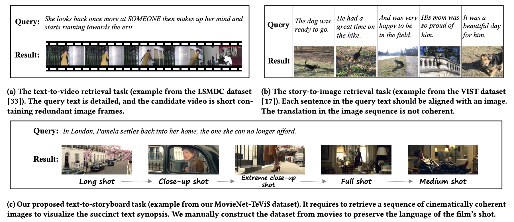

# Translating Text Synopses to Video Storyboards

## What is TeViS task?

In order to reduce the gap between existing tasks and realistic needs for storyboard creation, we propose a new task called Text synopsis to Video Storyboard (TeViS). In the TeViS task, we aim to retrieve an ordered sequence of images from large-scale movie database as video storyboard to visualize an input text synopsis.

## What is MovieNet-TeViS Dataset?

In the TeViS task, we aim to retrieve an ordered sequence of images from large-scale movie database as video storyboard to visualize an input text synopsis. For this purpose, we collect the MovieNet-TeViS benchmark based on the public MovieNet dataset.
The following figure shows how we differ from existing tasks, other datasets.

We will release our code soon. Thanks for your patience.

## News

- :smiley:**June, 2023: [**MovieNet-TeViS dataset**]() was released publicly.**

## Citing TeViS

If you find the dataset and model useful for your research, please consider citing our paper. 😊

